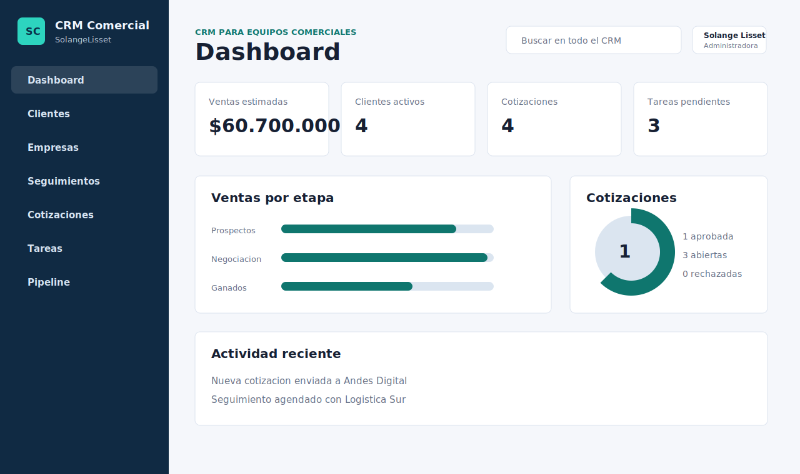
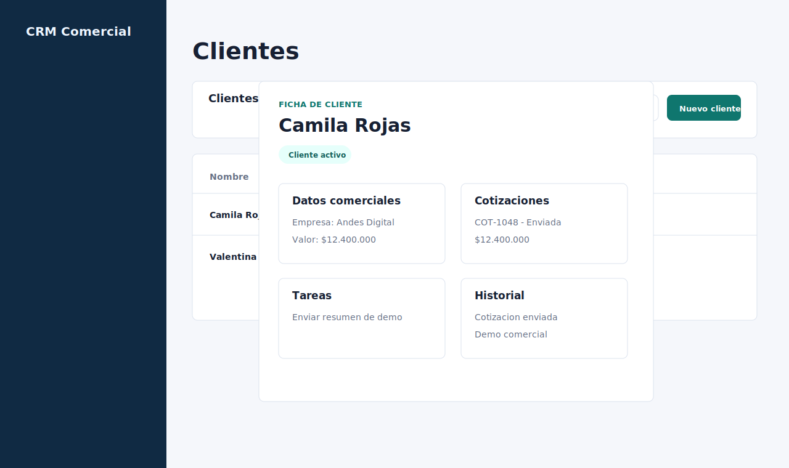
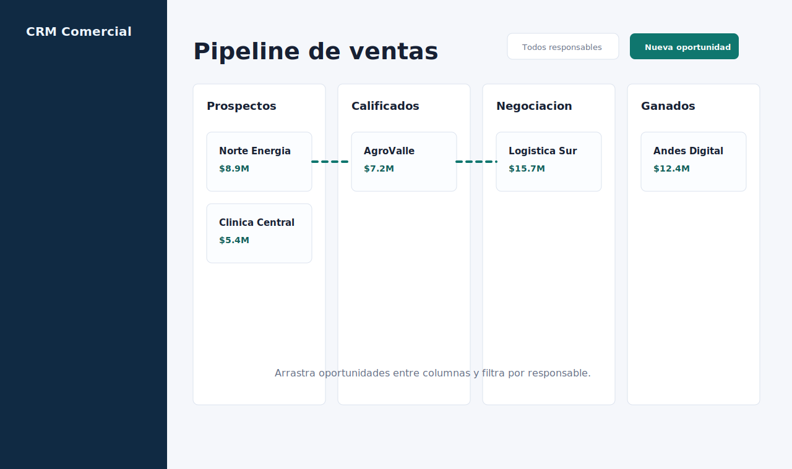

# CRM Comercial

[](https://react.dev/)
[](https://vite.dev/)
[](https://www.netlify.com/)
[](#licencia)
[](https://github.com/SolangeLisset)

CRM Comercial es una aplicacion web creada con React para gestionar clientes, empresas, seguimientos, cotizaciones, tareas y pipeline de ventas desde un dashboard central.

Autora: **SolangeLisset**



## Demo Online

Demo publicada en Netlify:

[https://solange-cmr.netlify.app/](https://solange-cmr.netlify.app/)

Repositorio: [SolangeLisset/CRM](https://github.com/SolangeLisset/CRM)

## Funcionalidades

### Dashboard Comercial

Metricas automaticas, actividad reciente y graficos para ventas por etapa, cotizaciones aprobadas y tareas completadas.


### Clientes y Ficha Detallada

Modulo de clientes con busqueda, filtro por estado, exportacion CSV y ficha detallada con cotizaciones, tareas, seguimientos e historial.



### Pipeline de Ventas

Pipeline tipo kanban con oportunidades movibles por arrastrar y soltar, filtro por responsable y creacion/edicion de oportunidades.



### Gestion Operativa

- Login visual simulado con `localStorage`.
- CRUD de clientes, empresas, cotizaciones, tareas y oportunidades.
- Busqueda global en clientes, empresas, cotizaciones, tareas y pipeline.
- Filtros por modulo.
- Tema claro/oscuro.
- Exportacion CSV para clientes y cotizaciones.
- Reset de datos demo.
- Validaciones basicas para email, montos y vencimientos.
- Persistencia local con `localStorage`.
- Diseño responsive.

## Tecnologias

- React
- Vite
- JavaScript modular
- CSS3
- Lucide React
- Netlify

## Estructura del Proyecto

```text
crm-comercial/
|-- docs/
|   |-- dashboard-logueado.svg
|   |-- clientes-ficha.svg
|   |-- pipeline-kanban.svg
|   `-- preview.svg
|-- src/
|   |-- components/
|   |-- utils/
|   |-- App.jsx
|   |-- data.js
|   |-- main.jsx
|   `-- styles.css
|-- index.html
|-- netlify.toml
|-- package.json
|-- package-lock.json
|-- README.md
`-- vite.config.js
```

## Como Ejecutar Localmente

Instala las dependencias:

```bash
npm install
```

Ejecuta el servidor de desarrollo:

```bash
npm run dev
```

Abre la URL que muestre Vite, normalmente:

```text
http://localhost:5173
```

Genera una version de produccion:

```bash
npm run build
```

Previsualiza el build:

```bash
npm run preview
```

## Deploy en Netlify

Este proyecto ya incluye `netlify.toml` con la configuracion correcta:

```toml
[build]
  command = "npm run build"
  publish = "dist"
```

Si conectas el repositorio desde Netlify:

1. Entra a Netlify y selecciona **Add new site**.
2. Elige **Import an existing project**.
3. Conecta GitHub y selecciona `SolangeLisset/CRM`.
4. Confirma estos valores:
   - Build command: `npm run build`
   - Publish directory: `dist`
5. Haz deploy.

Si aparece el error `Failed to load module script` o MIME `application/octet-stream`, significa que Netlify esta publicando el proyecto sin compilar. Revisa que el directorio publicado sea `dist`, no la raiz del proyecto.

## Ideas Futuras

- Conectar con una API o base de datos real.
- Agregar roles y permisos reales.
- Exportar cotizaciones a PDF.
- Agregar reportes por fecha y ejecutivo comercial.

## Licencia

Proyecto creado para uso educativo y portafolio personal.
