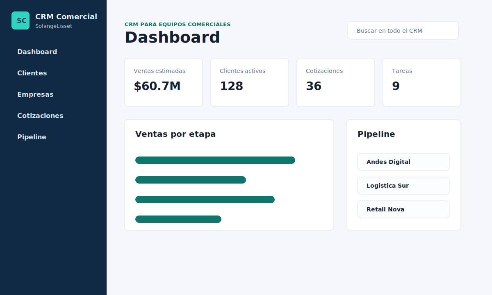

# CRM Comercial

[](https://react.dev/)
[](https://vite.dev/)
[](https://www.netlify.com/)

CRM Comercial es una aplicacion web sencilla, ordenada y visualmente cuidada creada con React para gestionar clientes, empresas, seguimientos, cotizaciones, tareas y pipeline de ventas desde un dashboard central.

Autora: **SolangeLisset**



## Caracteristicas

- Dashboard con metricas comerciales.
- Login visual simulado con localStorage.
- Modulo de clientes con busqueda.
- Filtro de clientes por estado comercial.
- Ficha detallada de cliente con cotizaciones, tareas, seguimientos e historial.
- Modulo de empresas con resumen de contactos, ingresos y salud comercial.
- Seguimientos organizados como linea de tiempo.
- Cotizaciones con estado, monto y vencimiento.
- Tareas con prioridad y responsables.
- Pipeline de ventas tipo kanban.
- Creacion, edicion y eliminacion de registros.
- Persistencia con localStorage para conservar la informacion en el navegador.
- Movimiento de oportunidades entre etapas del pipeline con arrastrar y soltar.
- Calculo automatico de metricas del dashboard.
- Busqueda global en clientes, empresas, cotizaciones, tareas y oportunidades.
- Filtros por modulo.
- Graficos comerciales en el dashboard.
- Exportacion CSV para clientes y cotizaciones.
- Tema claro/oscuro.
- Reset de datos demo.
- Diseno responsive para escritorio y mobile.

## Tecnologias

- HTML5
- CSS3
- React
- Vite
- JavaScript modular
- Iconos con Lucide React

## Estructura del proyecto

```text
crm-comercial/
├── index.html
├── package.json
├── README.md
├── vite.config.js
└── src/
    ├── App.jsx
    ├── main.jsx
    ├── data.js
    ├── styles.css
    ├── components/
    └── utils/
```

## Como ejecutar

Instala las dependencias y ejecuta el servidor de desarrollo.

```bash
npm install
npm run dev
```

Luego abre la URL que muestre Vite, normalmente:

```bash
http://localhost:5173
```

Para generar una version lista para publicar:

```bash
npm run build
```

## Publicar en GitHub Pages

1. Sube el proyecto a un repositorio de GitHub.
2. Entra a Settings > Pages.
3. Selecciona la rama principal y la carpeta raiz del proyecto.
4. Guarda los cambios y espera a que GitHub genere la URL publica.

## Publicar en Netlify

El proyecto incluye `netlify.toml`, por lo que Netlify debe usar esta configuracion:

- Build command: `npm run build`
- Publish directory: `dist`

Demo en Netlify: agrega aqui la URL final que entregue Netlify cuando el sitio este publicado.

Si Netlify muestra un error de MIME para `src/main.jsx`, significa que esta publicando el proyecto sin compilar. Revisa que el deploy use la configuracion anterior.

## Ideas para mejorar

- Conectar con una API o base de datos.
- Crear login y roles de usuario.
- Exportar cotizaciones a PDF.
- Agregar reportes comerciales por fecha y ejecutivo.

## Licencia

Proyecto creado para uso educativo y portafolio personal.
